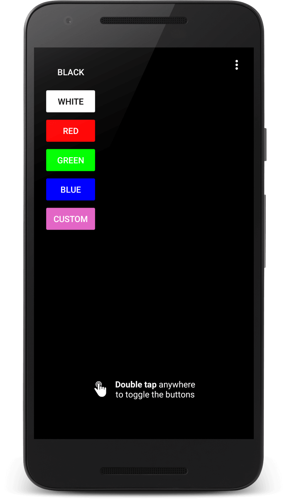
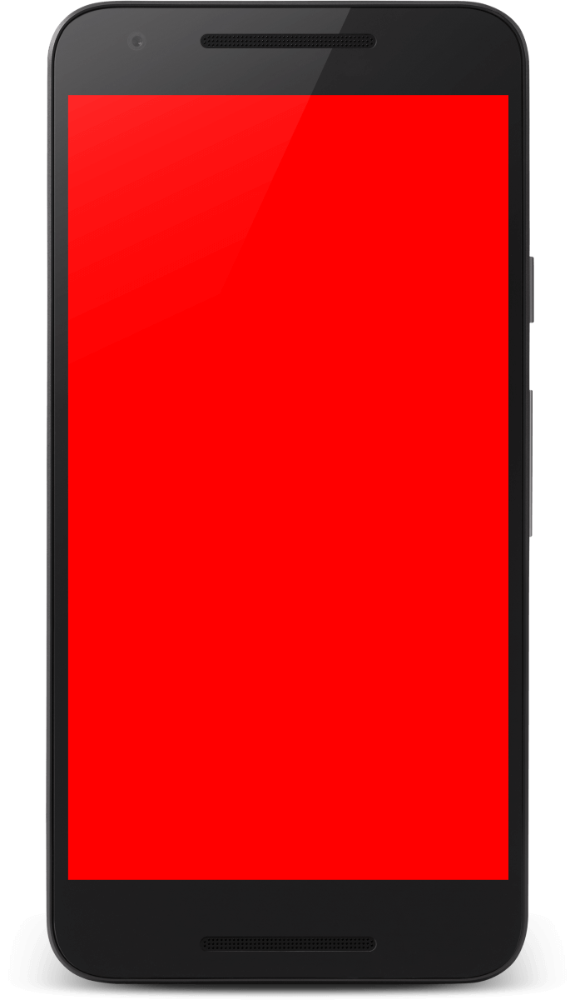

# InjuredPixels (for Android)

Use InjuredPixels to test the screen of a smartphone or tablet in the store, before buying, or during the warranty period, as you may get a replacement according to the manufacturer's dead pixel policy. InjuredPixels fills the entire screen with a primary or custom color, helping you to easily spot pixels that do not match the selected color. 

The app is very easy to use: 

- tap the color buttons or use the volume keys to cycle through colors
- double tap anywhere to hide the buttons and check every inch for defects
- double tap again to show the buttons
- swipe down from the top of the screen and tap Back or Home to exit the app

Note: When going full (empty) screen, touching, tapping or swiping does nothing, giving you the freedom to clean or gently rub any area while testing.

InjuredPixels if free and open source, doesn't show ads, and doesn't require Internet or extra permissions.

> "Beautifully simple." (Sanjay Lakra on Google Play)

**[Download APK from Github Releases](https://github.com/aurelitec/injuredpixels-android/releases/latest)**

## Screenshots

## Source Code

InjuredPixels for Android is written in Java using Android Studio.

## Contributions

Contributions are welcome: code, text, documentation, design, graphics, suggestions. Please fork this repository and contribute back using [pull requests](https://github.com/aurelitec/injuredpixels-android/pulls), [submit an issue](https://github.com/aurelitec/injuredpixels-android/issues), or [send an email](https://www.aurelitec.com/support/).

## Sponsor

InjuredPixels for Android (and all Aurelitec free applications) are supported by [East-Tec](http://www.east-tec.com), the home of [east-tec Eraser](http://www.east-tec.com/eraser/), the privacy tool that quickly and securely covers your online and PC tracks.

## License

InjuredPixels for Android is licensed under the [Apache License Version 2.0](LICENSE).
